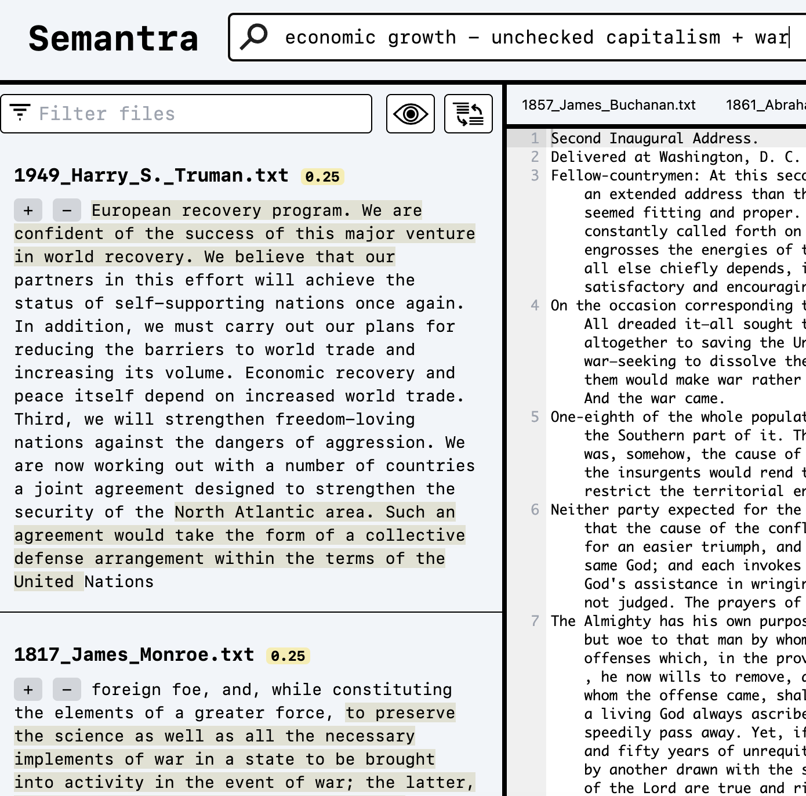

> NOTA: Esta es una versión traducida al español y podría estar desactualizada con respecto al original README.
>
> NOTE: This is a translated version and may be outdated with the original README.

# Semantra

https://user-images.githubusercontent.com/306095/233867821-601db8b0-19c6-4bae-8e93-720b324dc199.mov

Semantra es una herramienta multipropósito para la búsqueda semántica de documentos. Consulta por significado en lugar de solo por coincidencia de texto.

La herramienta, creada para ejecutarse en la interfaz de la línea de comandos, analiza los archivos de texto y PDF especificados en su computadora y lanza una aplicación de búsqueda web local para consultarlos de forma interactiva. El propósito de Semantra es hacer que el funcionamiento de un motor de búsqueda semántico especializado sea fácil, amigable, configurable y privado/seguro.

Semantra está diseñado para personas que buscan agujas en un pajar: periodistas que analizan documentos filtrados en la fecha límite, investigadores que buscan información dentro de los artículos, estudiantes que se involucran con la literatura consultando temas, historiadores que conectan eventos en libros, etc.

## Recursos

- [Tutorial](./tutorial.md): Una breve introducción para comenzar con Semantra: desde la instalación de la herramienta, hasta ejemplos prácticos de análisis de documentos con ella.
- [Guías](./guides.md): Guías prácticas sobre cómo hacer más con Semantra.
- [Conceptos](./concepts.md): Explicaciones sobre algunos conceptos para comprender mejor cómo funciona Semantra.
- [Uso de la interfaz web](./help.md): Una referencia sobre cómo usar la aplicación web Semantra.

Esta página ofrece una descripción general de alto nivel de Semantra y una referencia de sus características.

## Instalación

Asegúrese de tener [Python >= 3.9](https://www.python.org/downloads/).

La forma más fácil de instalar Semantra es a través de `pipx`. Si no tiene `pipx` instalado, ejecute en el terminal:

```sh
python3 -m pip install --user pipx
python3 -m pipx ensurepath
```

Abra una nueva ventana de terminal para que entren en vigor los nuevos ajustes de ruta `pipx`. Entonces corra:

```sh
pipx install semantra
```

Esto instalará Semantra en su directorio. Debería poder ejecutar `semantra` en el terminal y ver el resultado.

## Uso

Semantra opera en colecciones de documentos (archivos de texto o PDF) almacenados en su computadora local.

En su forma más simple, puede ejecutar Semantra sobre un solo documento ejecutando:

```sh
semantra doc.pdf
```

También puede ejecutar Semantra en varios documentos:

```sh
semantra report.pdf book.txt
```

Semantra tardará un tiempo en procesar los documentos de entrada. Esta es una operación única por documento (las ejecuciones posteriores sobre la misma colección de documentos serán casi instantáneas).

Una vez que se complete el procesamiento, Semantra iniciará un servidor web local, de manera predeterminada en [localhost:8080](http://localhost:8080). En esta página web, puede consultar de forma interactiva los documentos transmitidos semánticamente.

**Notas rápidas:**

Cuando ejecuta Semantra por primera vez, puede tomar varios minutos y varios cientos de megabytes de espacio en el disco duro para descargar un modelo de aprendizaje automático local que pueda procesar el documento que desea consultar. [El modelo utilizado se puede personalizar] (./guide_models.md) , pero el predeterminado es una excelente combinación al ser rápido, ágil y efectivo.

Si desea procesar documentos rápidamente sin usar sus propios recursos computacionales y no le importa pagar o compartir datos con servicios externos, puede usar [el modelo de incrustación de OpenAI] (./guide_openai.md).

## Recorrido rápido por la aplicación web

Cuando navegue por primera vez a la interfaz web de Semantra, verá una pantalla como esta:


Escriba algo en el cuadro de búsqueda para comenzar a consultar semánticamente. Pulse <kbd>Enter</kbd> o haga clic en el icono de búsqueda para ejecutar la consulta.

Los resultados de la búsqueda aparecerán en el panel izquierdo ordenados por los documentos más relevantes:


Los puntajes amarillos muestran relevancia de 0-1.00. Cualquier resultado en el rango de 0,50 indica una fuerte coincidencia. Los párrafos resaltados de color marrón claro aparecerán en los resultados de la búsqueda y explicarán las partes más relevantes de su consulta.

Al hacer clic en el texto de un resultado de búsqueda, se navegará a la sección correspondiente del documento asociado.


Al hacer clic en los botones más/menos asociados con un resultado de búsqueda, se etiquetarán de manera positiva/negativa esos resultados. Al volver a ejecutar la consulta hará que estos parámetros de consulta adicionales entren en vigor.


Finalmente, las consultas de texto se pueden sumar y restar con signos más/menos en el texto de la consulta para esculpir un significado semántico preciso.



Para obtener un recorrido más detallado de la aplicación web, consulte el [tutorial](./tutorial.md) o [la referencia de la aplicación web](./help.md).

## Conceptos rápidos

El uso de un motor de búsqueda semántica es fundamentalmente diferente a un algoritmo de coincidencia de texto exacto.

Para empezar, _siempre_ habrán resultados de búsqueda para una consulta determinada, sin importar cuán irrelevante sea. Las puntuaciones pueden ser realmente bajas, pero los resultados nunca desaparecerán por completo. Esto se debe a que la búsqueda semántica con aritmética de consulta a menudo revela resultados útiles en medio de diferencias de puntuación muy pequeñas. Los resultados siempre se ordenarán por relevancia y solo se mostrarán los 10 mejores resultados por documento, por lo que los resultados con menor puntuación se eliminarán automáticamente.

Otra diferencia es que Semantra no necesariamente encontrará coincidencias de texto exactas si consulta algo que aparece directamente en el documento. En un nivel alto, esto se debe a que las palabras pueden significar diferentes cosas en diferentes contextos, por ejemplo, la palabra "hojas" puede referirse a las hojas de los árboles o a las páginas de un libro _(en la versión original en inglés el ejemplo seleccionado por el autor de la aplicación es el siguiente: the word "leaves" can refer to the leaves on trees or to someone leaving)_. Los modelos de incrustación que utiliza Semantra convierten todo el texto y las consultas que ingresa en largas secuencias de números que se pueden comparar matemáticamente, y una coincidencia de subcadena exacta no siempre es significativa en este sentido. Consulte [el documento sobre el concepto de incrustaciones](./concept_embeddings.md) para obtener más información sobre incrustaciones _(embeddings)_.

## Referencia de la línea de comandos

```sh
semantra [OPTIONS] [FILENAME(S)]...
```

## Opciones

- `--model [openai|minilm|mpnet|sgpt|sgpt-1.3B]`: Modelo preestablecido para incrustar. Consulte [la guía de modelos] (./guide_models.md) para obtener más información (predeterminado: mpnet)
- `--transformer-model TEXT`: Nombre del modelo de transformador Huggingface personalizado que se usará para incrustar (solo se debe especificar uno de `--model` y `--transformer-model`). Consulte [la guía de modelos](./guide_models.md) para obtener más información.
- `--windows TEXT`: Ventanas incrustadas para extraer. Una lista separada por comas con el formato "size[\_offset=0][_rewind=0]. Una ventana con tamaño 128, desplazamiento 0 y rebobinado de 16 (128_0_16) incrustará el documento en fragmentos de 128 tokens que se superponen parcialmente por 16. Solo se usa la primera ventana para la búsqueda. Consulte el [documento de concepto de ventanas] (./concept_windows.md) para obtener más información (predeterminado: 128_0_16)
- `--encoding`: Codificación a usar para leer archivos de texto [predeterminado: utf-8]
- `--no-server`: No iniciar el servidor de UI (solo el proceso)
- `--port INTEGER`: Puerto a usar para el servidor integrado (predeterminado: 8080)
- `--host TEXT`: Host a usar para el servidor integrado (predeterminado: 0.0.0.0)
- `--pool-size INTEGER`: Número máximo de tokens de incrustación para agrupar en las solicitudes
- `--pool-count INTEGER`: Número máximo de incrustaciones para agrupar en las solicitudes
- `--doc-token-pre TEXT`: Token para anteponer a cada documento en los modelos transformadores (predeterminado: Ninguno)
- `--doc-token-post TEXT`: Token para agregar a cada documento en los modelos transformadores (predeterminado: Ninguno)
- `--query-token-pre TEXT`: Token para anteponer a cada consulta en los modelos transformadores (predeterminado: Ninguno)
- `--query-token-post TEXT`: Token para agregar a cada consulta en los modelos transformadores (predeterminado: Ninguno)
- `--num-results INTEGER`: Número de resultados (vecinos) a recuperar por archivo para consultas (predeterminado: 10)
- `--annoy`: Use kNN aproximados a través de Annoy para consultas (consultas más rápidas con un ligero costo de precisión); si es falso, use kNN exhaustivo exacto (predeterminado: True)
- `--num-annoy-trees INTEGER`: Número de árboles a usar para kNN aproximados a través de Annoy (predeterminado: 100)
- `--svm`: Use SVM en lugar de cualquier tipo de kNN para consultas (más lento y solo funciona en modelos simétricos)
- `--svm-c FLOAT`: Parámetro de regularización de SVM; los valores más altos penalizan más las predicciones erróneas (predeterminado: 1.0)
- `--explain-split-count INTEGER`: Número de divisiones en una ventana dada para explicar una consulta (predeterminado: 9)
- `--explain-split-divide INTEGER`: Factor para dividir el tamaño de la ventana para obtener cada longitud dividida para explicar una consulta (predeterminado: 6)
- `--num-explain-highlights INTEGER`: Número de resultados divididos para resaltar para explicar una consulta (predeterminado: 2)
- `--force`: Forzar proceso incluso si está en caché
- `--silent`: No imprimir información de progreso
- `--no-confirm`: No mostrar el costo y pedir confirmación antes de procesar con OpenAI
- `--version`: Imprime la versión y sale
- `--list-models`: Lista los modelos preestablecidos y sale
- `--show-semantra-dir`: Imprime el directorio que Semantra usará para almacenar archivos procesados y sale
- `--semantra-dir PATH`: Directorio para almacenar archivos de Semantra
- `--help`: Muestre este mensaje con las anteriores opciones y sale

## Preguntas frecuentes

### ¿Puede usar ChatGPT?

No, y esto es así desde su diseño.

Semantra no utiliza ningún modelo generativo como ChatGPT. Está diseñado solo para consultar texto semánticamente sin ninguna capa en la parte superior para intentar explicar, resumir o sintetizar los resultados. Los modelos de lenguaje generativo ocasionalmente producen información aparentemente plausible, pero en última instancia incorrecta, colocando la carga de la verificación en el usuario. Semantra trata el material de origen primario como la única fuente de verdad y se esfuerza por demostrar que una experiencia de búsqueda con interacción humana, además de modelos integrados más simples, es más útil para los usuarios.

## Desarrollo

La aplicación de Python se encuentra en `src/semantra/semantra.py` y es administrada como un proyecto estándar de línea de comandos de Python con `pyproject.toml`.

La aplicación web local está escrita en [Svelte](https://svelte.dev/) y es administrada como una aplicación npm estándar.

Para desarrollar para la aplicación web use`cd` en `client` y luego ejecute `npm install`.

Para compilar la aplicación web, ejecute `npm run build`. Para compilar la aplicación web en modo de observación y reconstruirla cuando haya cambios, ejecute `npm run build:watch`.

## Contribuciones

La aplicación aún se encuentra en las primeras etapas, sin embargo las contribuciones son siempre bienvenidas. No dude en enviar o someter un _problema (issue)_ si experimenta cualquier error o si tiene una solicitud sobre una función que desea se agregue a Semantra.
