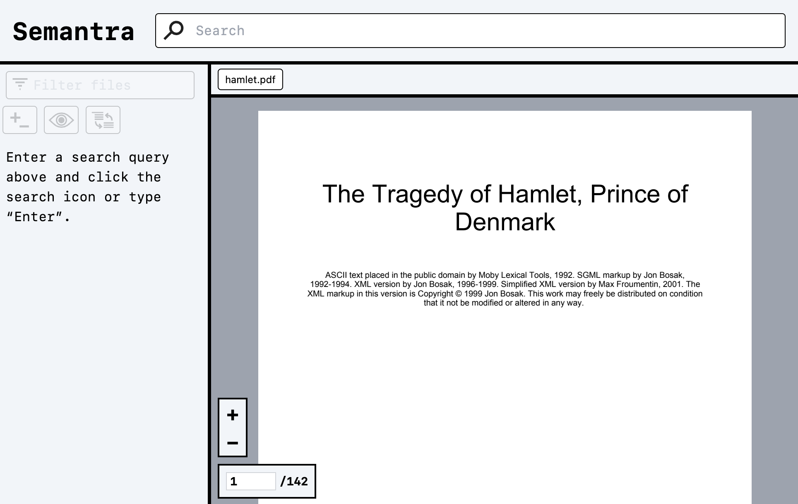
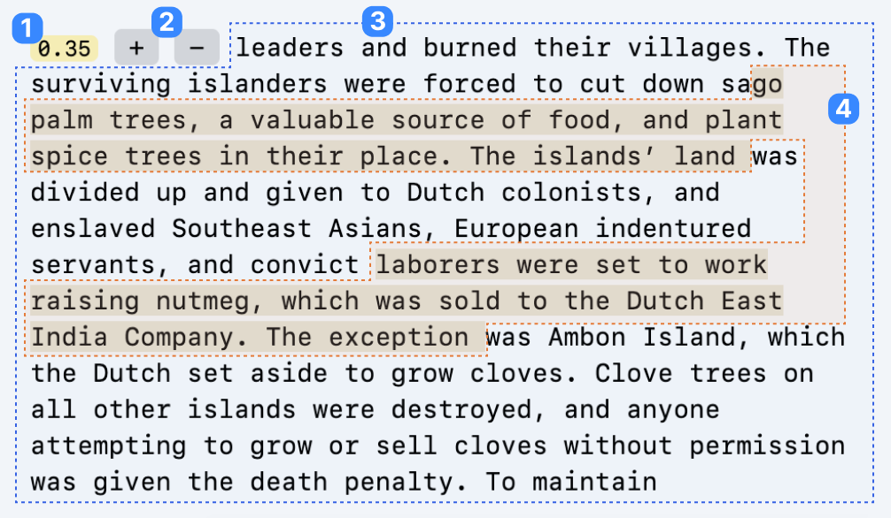

# Using the web interface

Welcome to Semantra! This document breaks down all the functionality in the web interface. If you would like a more hands-on guide, you may prefer reading the [tutorial](tutorial.md).

When you start the application you will see something like the below window.

Here's a breakdown of this interface:

- **search bar**: the top of the website where a long search bar runs across. This is where the main searching happens
- **results pane**: the left sidebar. This is where search results show up
- **tab bar**: shows all the files and highlights which one is loaded in the content window
- **content window**: displays a browseable document

## Search bar

The search bar is where you can run queries:

After typing a query in the search bar, it will become yellow to indicate the query has not yet run yet and interface may be stale:

You can press <kbd>Enter</kbd> or click on the search icon to run the query. The search bar should turn white again to indicate the results are up-to-date.

When tagging search results (see below), assigned tags will show up as blue (positive) and orange (negative) pills below the search bar.

To remove these tags, you can click on them under the search bar. If you want to read the full text of a tag on desktop, you can leave the mouse over the tag for a few seconds until a tooltip shows.

## Results pane

After executing a search, the results pane will fill with search results.

### Filter controls

There are filter controls at the top of the results pane. In order of appearance, they are:

- **hamburger button**: (only on mobile) a button to toggle collapsing the results pane and showing the content window
- **filter box**: a text input that will filter search results by file
- **toggle expand/collapse button**: (#1 in the diagram below) a button to toggle expanding and collapsing all the search results in the file-based view (default; does not appear in the results-based view)
- **displayed file filter button**: (#2 in the diagram below) a button to toggle filtering the search results to only show the file currently in the content window
- **switch file-/results-view button**: (#3 in the diagram below) a button to switch the view from a collapsible file-based view sorted by most relevant files to a view where each individual search result is sorted by relevance and not organized by file

### Search results

Each search result shows a score, plus/minus tagging buttons, and an excerpt with highlights. Clicking on the search result text will cause the content view to navigate to the relevant section of the associated document.

- **score**: (1) The score section of the result is a number from 0 (no match) to 1.00 (100% match). In the world of semantic similarity a score around 0.50 often indicates a good match.
- **plus/minus tagging buttons**: (2) Buttons to positively/negatively tag the search result. Clicking on one of these buttons will cause a tag to appear below the search box showing the document is tagged. Re-running the query will apply the tag and reflect it in the search results. Clicking on a tag button again will remove the tag.
- **text excerpt**: (3) This is the full text of the search result [window](concept_windows.md)
- **explanation highlight**: (4) Semantra will attempt to explain the most relevant parts of the search query asynchronously after results are displayed. These appear as sub-highlights within the result.

## Tab bar

This narrow strip shows all the documents that you are analyzing currently and highlights the active document in the content pane. You can scroll left and right in the tab bar to see all the tabs.

## Content window

The content window shows the content of the currently selected document. It will look different depending on if the document is a text file or PDF file.

### Text content window

The text content window displays the contents of a text file. It has no additional features or functionality.

### PDF content window

The PDF content window shows a PDF document and has the ability to view/set the page number and zoom in/out.

- **zooming in/out**: the +/- buttons in the bottom left allow zooming in and out of the PDF document
- **viewing/setting the page number**: the numbers in the lower left show the currently displayed page and the number of pages in the document. You can edit the left number to jump to a page.

## Additional resources

- Follow along with the [tutorial](tutorial.md)
- Check out the [guides](guides.md)
- Learn about some relevant [concepts](concepts.md)
